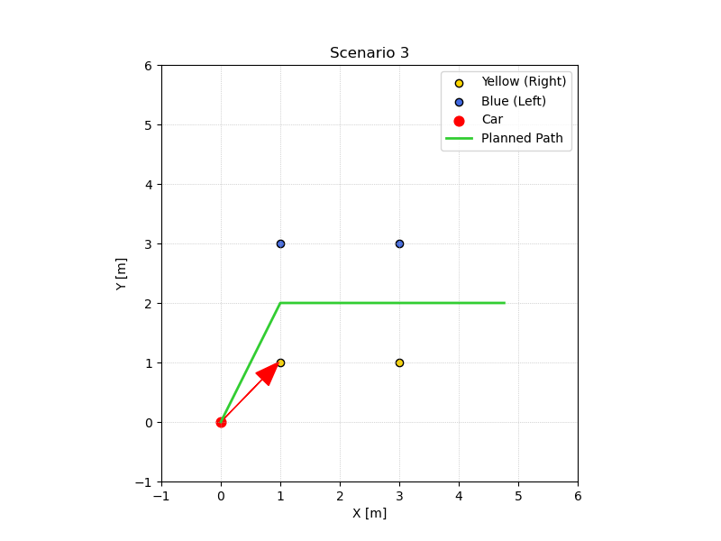
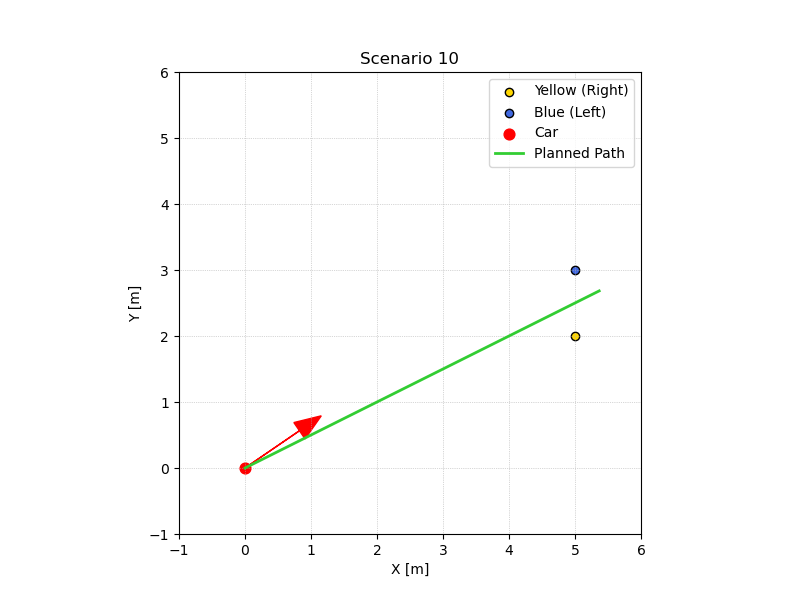
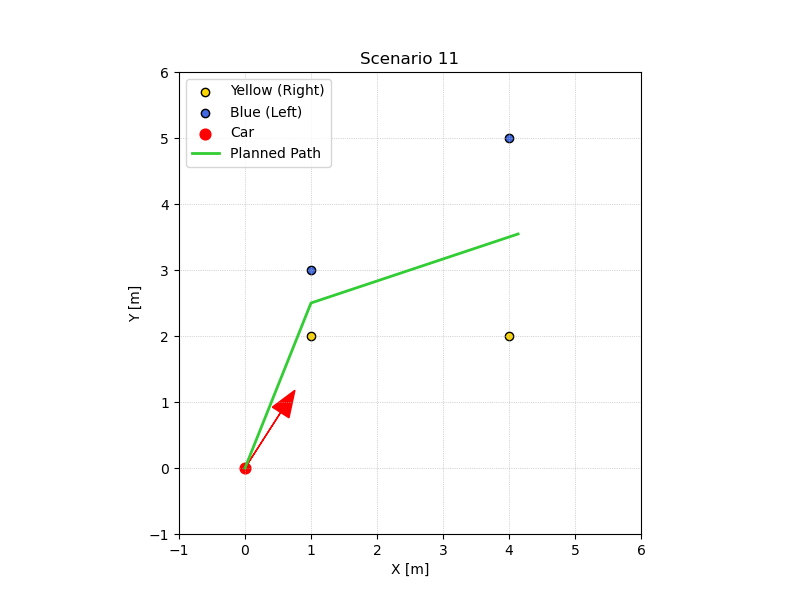
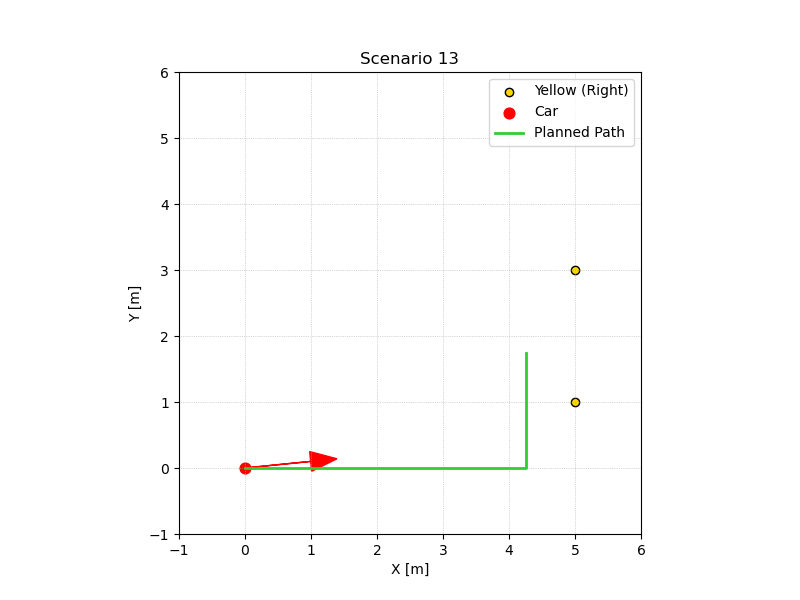
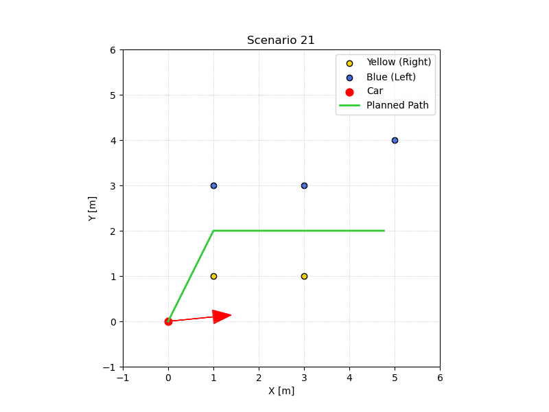
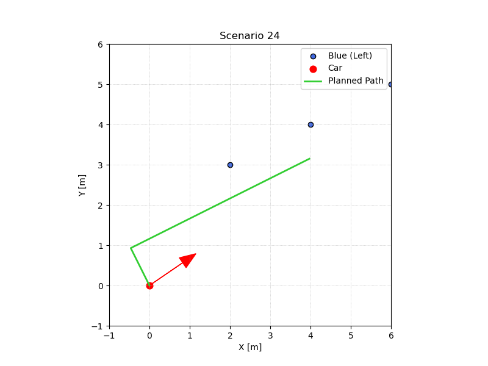

# FSAI-Style Cone Track Path Planning

A simple cone-gate path planner for the FSAI-style path planning task: given the
car pose `(x, y, yaw)` and a handful of detected cones (yellow = right boundary,
blue = left boundary), return a short drivable path that stays between the two
boundaries.

## Task Summary

- **Part 1** — implement `PathPlanning.generatePath()` in
  [`src/path_planning.py`](src/path_planning.py): return a 5–10 m path of `(x, y)`
  points (step ≤ 0.5 m) that stays between the left (blue) and right (yellow)
  boundaries, for 2, 1, or 0 cones per side.
- **Part 2** — handle three cones on one side of the track, add new test cases in
  [`src/scenarios.py`](src/scenarios.py), and explain the choice and its
  limitations (see below).

## Solution Approach

The planner uses a **cone-gate** strategy. Everything is computed in the car
frame (`x` = forward along yaw, `y` = left), which makes "left boundary" and
"right boundary" concrete:

1. **Filter** — drop cones more than 0.5 m behind the car; they cannot bound the
   road ahead.
2. **Pair cones into gates** — each blue (left) cone is paired with its nearest
   unused yellow (right) cone; the midpoint of every pair is a *gate* the path
   must pass through. Greedy nearest-pairing means each gate is the tightest
   available blue-yellow pair.
3. **One side visible** — if only one boundary is visible, no gate exists. With a
   single cone the path runs parallel to the heading, offset 0.75 m toward the
   car's side of that cone. With two or more cones the boundary is treated as a
   line through them; the path runs parallel to that line, offset 0.75 m toward
   the car's side.
4. **No cones** — the path is a straight 6 m line along the car's yaw.
5. **Shape the path** — waypoints are `car → gate₁ → gate₂ → ...`, extended past
   the last gate along the last segment's direction to reach ≈ 6 m, then
   densified to 0.25 m point spacing (≤ 0.5 m required). Total length is kept
   between 5 and 10 m.

The returned path is a geometric route: it passes through every gate midpoint,
so it lies between the visible boundaries wherever the boundaries are defined.
No obstacle-avoidance or curvature stage is used — intentionally, per the
"keep it simple" brief.

### Part 2: three cones on one side

When one side contributes more cones than the other, the greedy nearest-pairing
automatically uses only the tightest cross-side pairs: the surplus cone is
treated as evidence of a gate further ahead (or a stray detection) and is simply
not paired. When *all three* cones are on one side and the other side is empty,
the line-fit branch uses the two most distant cones as the boundary and the
third cone is consistent corroborating evidence of the same line.

New test scenarios (21–24) cover 3 blue + 2 yellow, 3 blue + 1 yellow,
2 blue + 3 yellow, and 3 blue + 0 yellow. All pass the constraint checks below.

## Assumptions

- The car starts inside the track and roughly faces the direction of travel;
  yaw is used to seed the frame but the path is not forced to start along yaw.
- Cones behind the car are irrelevant to the path ahead and are ignored.
- When only one side is visible, the track is assumed to continue straight;
  the path keeps the car's side of the visible boundary.
- A gate always exists between one blue and one yellow cone; the nearest
  cross-side pair is the current gate.
- The path is purely geometric (no steering/curvature limits); the car is
  assumed able to follow it.

## Limitations

- **Extra cone near the gate (slalom-style layouts)** can mislead the pairing:
  if the surplus cone is *closer* to the opposite side than the true gate cone,
  the gate is placed slightly off. Handled acceptably in scenarios 21–23, but a
  real slalom would need gate tracking across detections.
- **Cone behind the car that actually bounds the track** (scenario 14) is
  dropped, so the path hugs the visible side instead of the hidden gate.
- **Path may pass close to a cone** (scenarios 6, 11: ~0.2 m) when the car's
  heading points almost directly at a gate cone — the straight approach is not
  obstacle-aware. Still on the correct side of every cone.
- **Boundaries are only locally known**: past the last gate the path extends
  straight, assuming the track continues in the same direction.
- **No obstacle avoidance or dynamics** — by design (task scope).

## Quick Start

```bash
python -m venv .venv
source .venv/bin/activate          # Windows: .venv\Scripts\activate
pip install -r requirements.txt
python -m src.run --scenario 3     # opens a Matplotlib window
```

Run the showcase scenarios headlessly (writes plots to `output/` and checks the
constraints):

```bash
python scripts/validate_all.py          # top 6 showcase scenarios
python scripts/validate_all.py --all    # all 24 scenarios
```

## Scenarios

`src/scenarios.py` contains scenarios `1`–`20` (up to 2 cones per side on a 5×5
grid) plus `21`–`24` added for Part 2 (three cones on one side). The showcase
set below exercises the interesting cases — full set available via
`--scenario N` / `--all`:

| Scenario | What it exercises |
|---|---|
| 3 | two straight gates — classic corridor (Part 1) |
| 10 | single gate ahead, car at an angle (Part 1) |
| 11 | offset gates + stray far cone (hardest Part 1) |
| 13 | boundary-only, two cones on one side (line-fit) |
| 21 | **Part 2:** 3 blue + 2 yellow — extra cone ignored |
| 24 | **Part 2:** 3 blue + 0 yellow — boundary-only line-fit |

<p align="center">
  
  
  
  
  
  
</p>

Legend: gold = yellow (right), blue = blue (left), red dot + arrow = car pose
and heading, green line = planned path.

## Files

- `src/models.py` — `Cone`, `CarPose`, `Path2D` data classes
- `src/path_planning.py` — the solution (`PathPlanning.generatePath`)
- `src/scenarios.py` — test scenarios, including the new Part 2 cases
- `src/tester.py` — Matplotlib visualizer
- `src/run.py` — CLI (`python -m src.run --scenario N`)
- `scripts/validate_all.py` — headless check + plots for the showcase scenarios (`--all` for the full set)
- `output/` — one plot per showcase scenario
